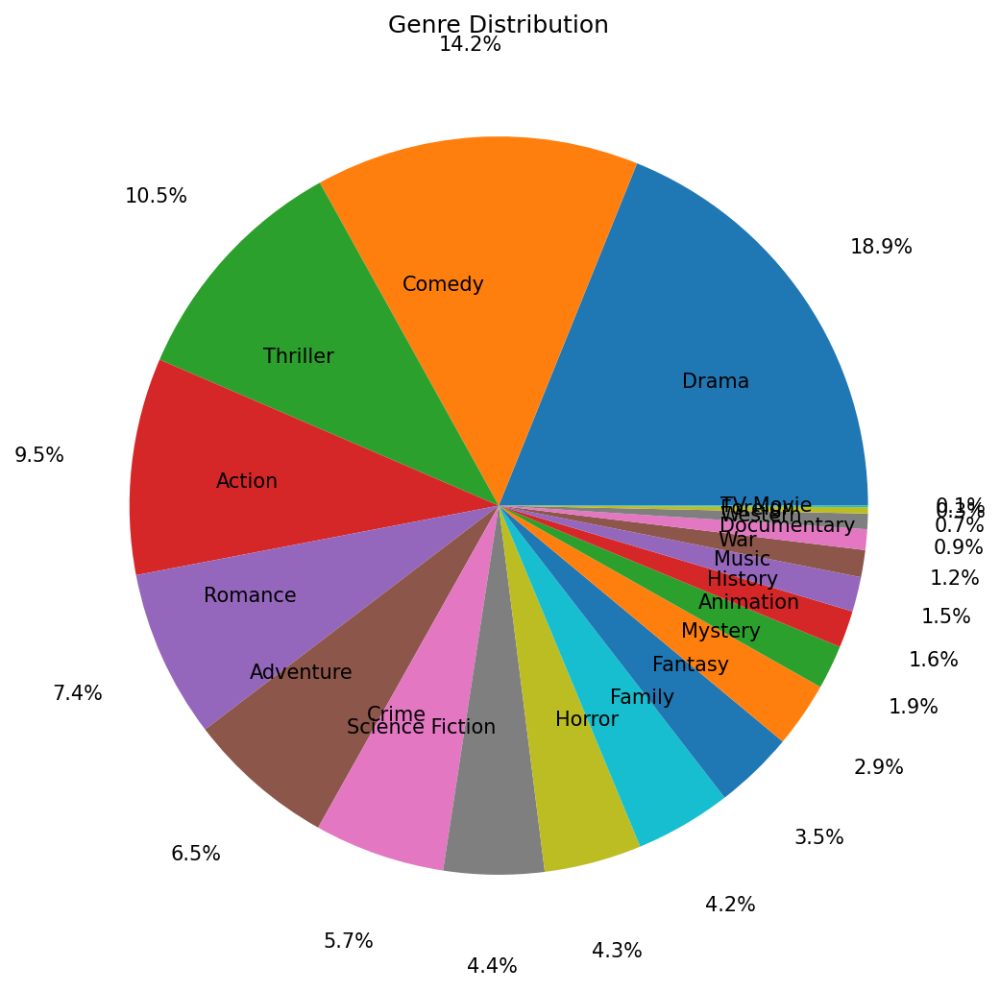
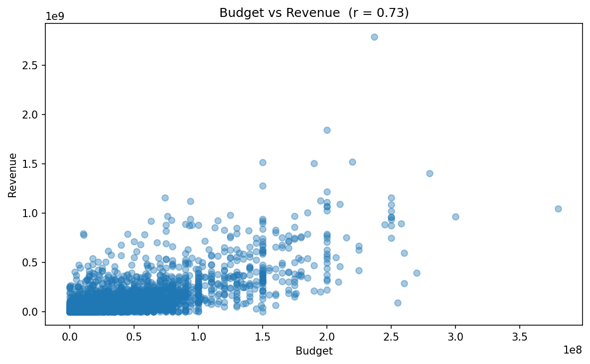
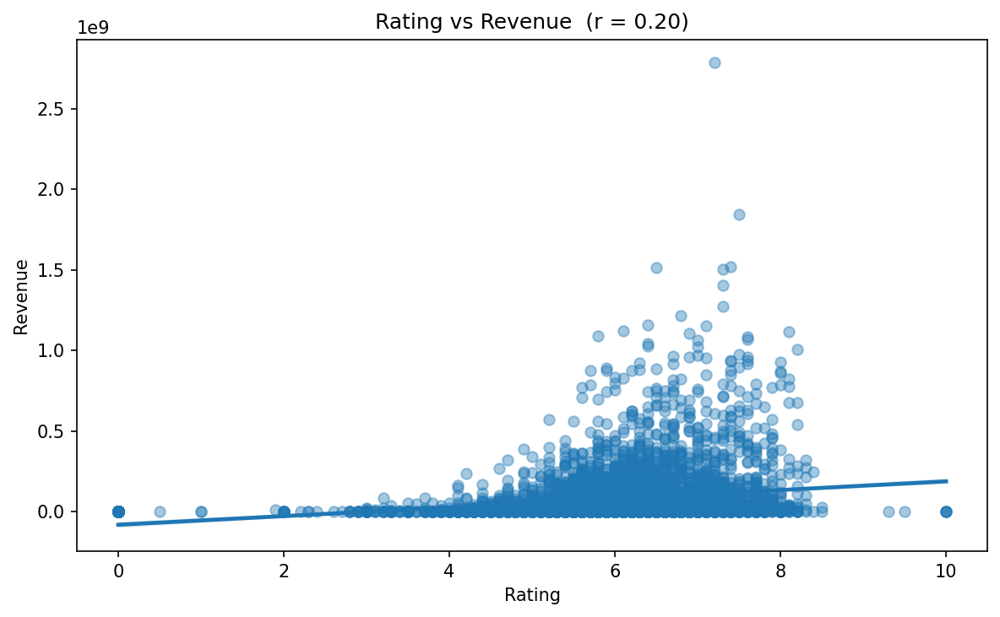
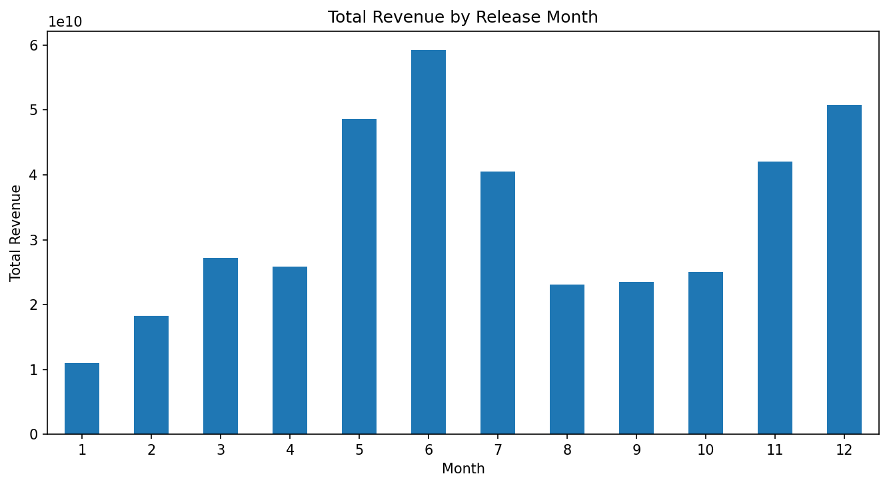
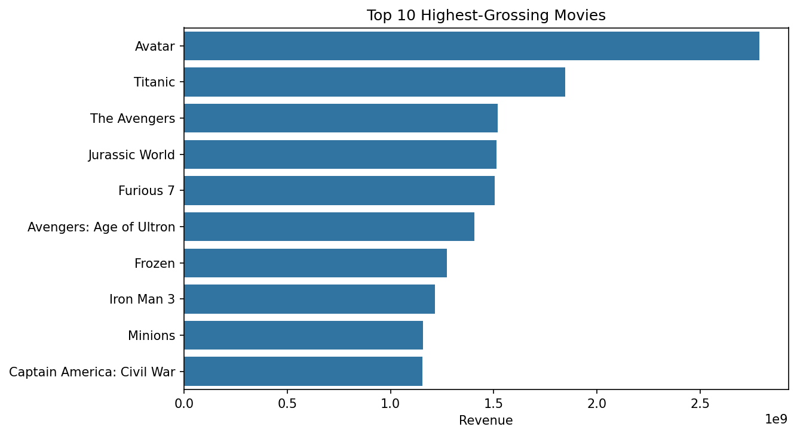
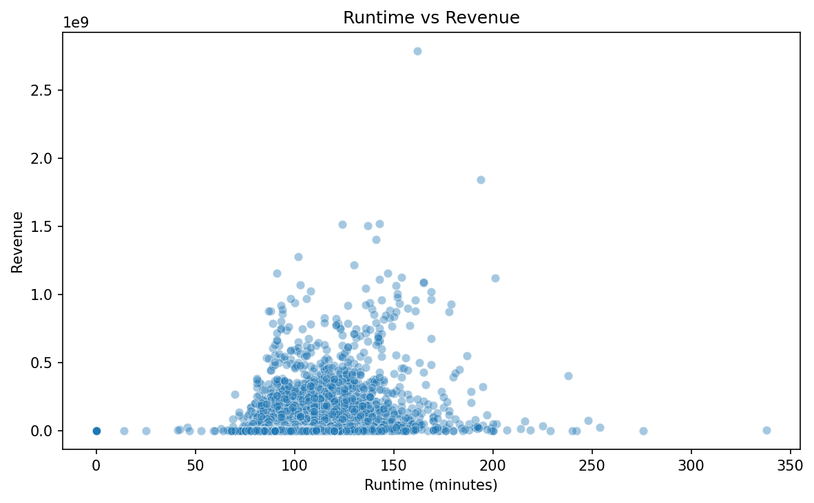
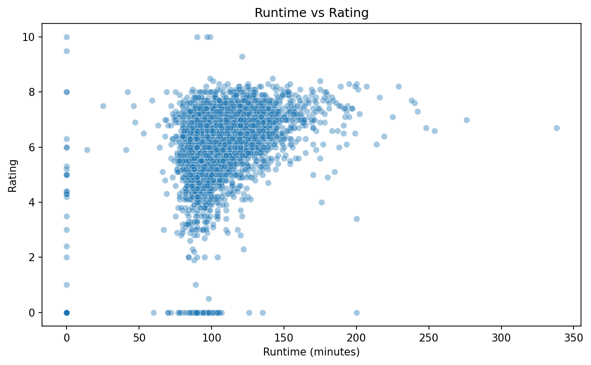

# 🎬 TMDB 5000 Movies — Exploratory Data Analysis

A full exploratory data analysis of the TMDB 5000 Movies dataset, covering data cleaning, feature engineering, encoding of multi-valued categorical columns, and visual analysis of key relationships in the data.

---

## Dataset

- **Source:** [TMDB 5000 Movie Dataset — Kaggle](https://www.kaggle.com/datasets/tmdb/tmdb-movie-metadata)
- **File:** `tmdb_5000_movies.csv`
- **Size:** 4,803 movies × 20 columns

---

## Analysis Questions

1. What are the most common movie genres?
2. Is there a relationship between **budget** and **revenue**?
3. Does a higher **rating** lead to higher revenue?
4. Which **months** generate the highest total revenue?
5. What are the **top 10 highest-grossing** movies?
6. How does **runtime** relate to revenue and ratings?

---

## Project Structure

```
tmdb-eda/
│
├── tmdb_5000_movies.csv       # Raw dataset
├── tmdb_eda.ipynb             # Main analysis notebook
└── README.md
```

---

##  Data Cleaning

- Dropped irrelevant or non-analytical columns: `homepage`, `id`, `overview`, `tagline`, `title`, `status`
- Dropped 1 row with a missing `release_date`
- Filled 2 missing `runtime` values with the **median**
- Parsed JSON-like string columns (`genres`, `keywords`, `spoken_languages`, `production_companies`, `production_countries`) using `ast.literal_eval` to extract name lists
- Removed 2 malformed/empty language columns (empty string key and `??????`)

---

## ⚙️ Feature Engineering

| Feature | Description |
|---|---|
| `year` | Extracted from `release_date` |
| `month` | Extracted from `release_date` |
| Genre dummy columns | One-hot encoded (all 20 genres) |
| Language dummy columns | One-hot encoded (all spoken languages) |
| Country dummy columns | One-hot encoded (all production countries) |
| Company dummy columns | One-hot encoded (top 20 companies) |
| Keyword dummy columns | One-hot encoded (top 50 keywords) |

> Final dataframe: **4,802 rows × 252 columns**

---

## Visualizations

### 1. Genre Distribution
> Pie chart showing the proportion of each genre across all movies.



---

### 2. Budget vs Revenue
> Scatter plot exploring the correlation between production budget and box office revenue.

- **Pearson correlation: 0.73** — strong positive relationship



---

### 3. Rating vs Revenue
> Regression plot examining whether higher-rated movies earn more.

- **Pearson correlation: 0.20** — weak positive relationship
- Rating alone is not a reliable predictor of revenue



---

### 4. Revenue by Month
> Bar chart of total revenue per calendar month.



---

### 5. Top 10 Highest-Grossing Movies
> Horizontal bar chart of the 10 movies with the highest total revenue.

| Rank | Movie | Revenue |
|---|---|---|
| 1 | Avatar | $2.79B |
| 2 | Titanic | $1.85B |
| 3 | The Avengers | $1.52B |
| 4 | Jurassic World | $1.51B |
| 5 | Furious 7 | $1.51B |
| 6 | Avengers: Age of Ultron | $1.41B |
| 7 | Frozen | $1.27B |
| 8 | Iron Man 3 | $1.22B |
| 9 | Minions | $1.16B |
| 10 | Captain America: Civil War | $1.15B |



---

### 6. Runtime vs Revenue
> Scatter plot of movie length against box office performance.



---

### 7. Runtime vs Rating
> Scatter plot of movie length against audience rating.



---

## Key Findings

- **Budget is the strongest predictor of revenue** (r = 0.73). Big-budget productions tend to earn significantly more.
- **Rating has a weak effect on revenue** (r = 0.20). A well-rated film does not guarantee high box office returns.
- **Summer months (May–July) and November** show the highest cumulative revenue, aligning with blockbuster release windows.
- **Drama** is the most common genre, but **Action** and **Adventure** dominate the top-grossing films.
- **Runtime shows no strong linear relationship** with either revenue or rating.

---

## Requirements

```
pandas
numpy
matplotlib
seaborn
```

Install with:

```bash
pip install pandas numpy matplotlib seaborn
```

---

## How to Run

```bash
git clone https://github.com/theyoussefmoussa/tmdb_movies.git
cd tmdb_movies
jupyter notebook movies.ipynb
```

> Make sure `tmdb_5000_movies.csv` is in the same directory as the notebook.

---

## Author

**Youssef Moussa**
[GitHub](https://github.com/theyoussefmoussa) | [LinkedIn](https://www.linkedin.com/in/theyoussefmoussa)